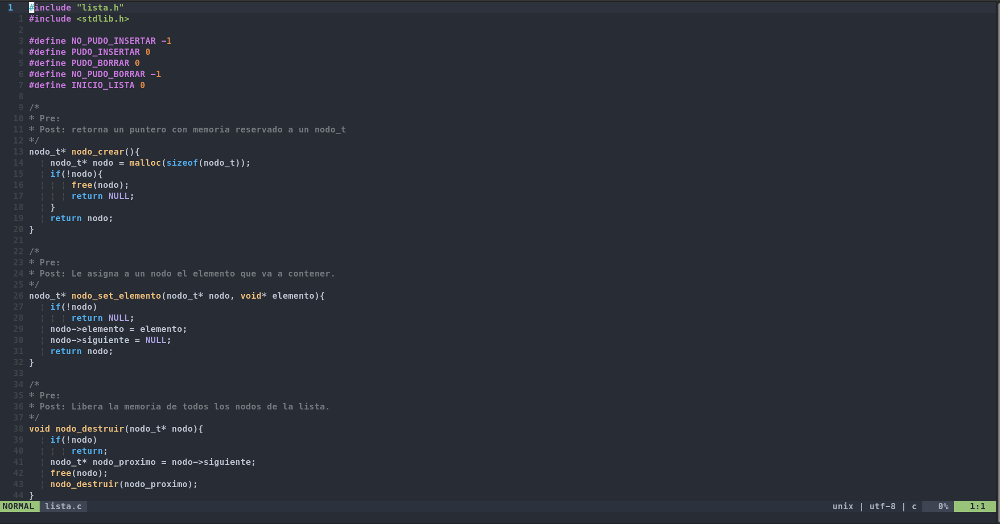

<detils>
<summary>
Information
</summary>
Author: Leandro Wolff
</details>

# Config IDE :shield:

My Setup config for neovim based on [nschurman](https://github.com/nschurmann/configs) repo. 

## Preview



## Setup Configuration

- Update and upgrade your system

```sh
sudo apt-get update && sudo apt-get upgrade -y
```

- Install Neovim

```sh
sudo apt-get install neovim
```

- Configure providers following the steps of this link:

[Provider]:https://neovim.io/doc/user/provider.html

- Install Plug-vim

```sh
sh -c 'curl -fLo "${XDG_DATA_HOME:-$HOME/.local/share}"/nvim/site/autoload/plug.vim --create-dirs \
       https://raw.githubusercontent.com/junegunn/vim-plug/master/plug.vim'
```

- Move `./.vim` to `~/`

- Move `./init.vim` to `.config/nvim/`

- Open `nvim`

- Run `:PlugInstall` 

- Install the language of your preference with `:CocInstall`

[Coc Language Servers](https://github.com/neoclide/coc.nvim/wiki/Language-servers)


