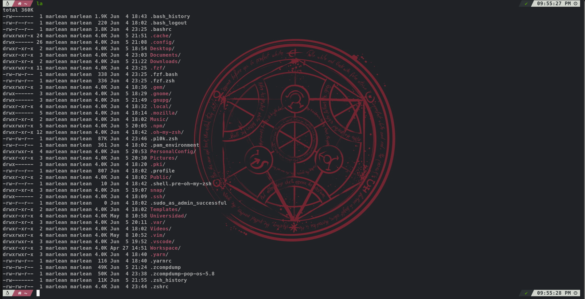

# Terminal Config :crossed_swords:

My personal configuration for Terminal.

## Preview



## Steps Configuration 

- Update your system.

```
sudo apt-get update && sudo apt-get upgrade -y
```

- Install ZSH.

```
sudo apt-get install zsh
```

- Install fonts provided by the repository in the directory ./fonts.

- Install oh-my-zsh.

```
sh -c "$(curl -fsSL https://raw.github.com/ohmyzsh/ohmyzsh/master/tools/install.sh)"
```

- Reboot Terminal.

- Install fzf.

```
git clone --depth 1 https://github.com/junegunn/fzf.git ~/.fzf
~/.fzf/install
```

- Install p10k.

```
git clone --depth=1 https://github.com/romkatv/powerlevel10k.git ${ZSH_CUSTOM:-$HOME/.oh-my-zsh/custom}/themes/powerlevel10k
```

- Clone Plugins repos.
 
```
git clone https://github.com/zsh-users/zsh-autosuggestions ${ZSH_CUSTOM:-~/.oh-my-zsh/custom}/plugins/zsh-autosuggestions
```

```
git clone https://github.com/zsh-users/zsh-syntax-highlighting.git ${ZSH_CUSTOM:-~/.oh-my-zsh/custom}/plugins/zsh-syntax-highlighting
```

- Move file `.zshrc` to `~/`

- Set terminal font to any font(Suggested: MesloLGS NF Bold) provided by the font directory.

- Configure Terminal

```
p10k configure
```

- Reboot Terminal.


